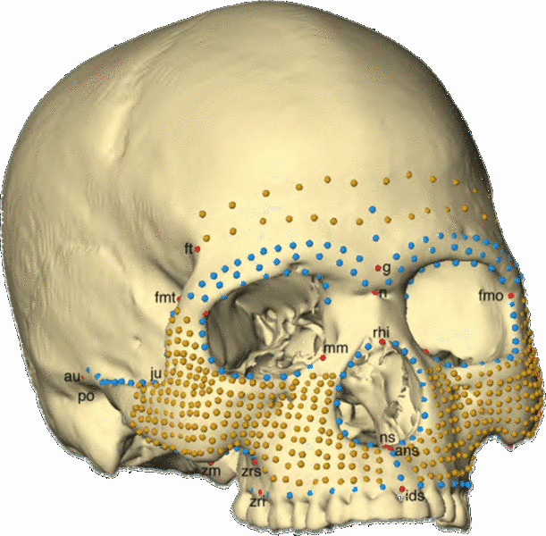

```{r, echo =FALSE}
knitr::opts_chunk$set(cache = TRUE, autodep = TRUE)
```
# Welcome, friends! 

Please go forth and scroll down to begin your journey though our group module assignment for AN 597. Our topic is "3D visualization and analysis".  
1. First, Julie will cover how to plot 3d surfaces, both non-interactively and interactively.  
2. Then Maria will cover how to collect and plot 3d landmark data.  
3. Finally, Zach will go over how to analyze landmark data.  

## A brief introduction to non-interactive 3D plots

### persp() function

In the base R graphics system, the function persp() draws perspective plots of a surface over the x–y plane. Uncomment to run demo(persp). The demo will give you an idea of what this function can do. 

```{r}
#demo(persp)
```

A demo is an .R file that lives in demo/ . Demos are like examples but tend to be longer. We can use the following line of code to check which packages have demo(). 

```{r}
demo(package=.packages(all.available = TRUE))
```

### {plot3D} package 

The plot3D package builds on on persp() to provide functions for both 2D and 3D plotting. Load the plot3D package and uncomment go through some pretty impressive plot examples:

```{r}
#install.packages("plot3D")
library("plot3D")

#example(surf3D) #examples of 3D surfaces
#example(persp3D) 
```

Let's do an example on our own. Use surf3D() to create a cut-away view of a Torus.

```{r}
# 3D Plot of Half of a Torus
par(mar = c(2, 2, 2, 2))
par(mfrow = c(1, 1))
R <- 3
r <- 2
x <- seq(0, 2*pi,length.out=50)
y <- seq(0, pi,length.out=50)
M <- mesh(x, y)
 
alpha <- M$x
beta <- M$y

surf3D(x = (R + r*cos(alpha)) * cos(beta),
       y = (R + r*cos(alpha)) * sin(beta),
       z = r * sin(alpha),
       colkey=FALSE,
       bty="b2",
       main="Half of a Torus")
```

Pretty cool, right? :D We can use these functions to create any 3D surface we can imagine. 

### {scatterplot3d} package 

It turns out there are SO MANY ways to create a 3D scatterplot, and (to me at least) all of them seem really useful and elegant. As you'll see, there are pros and cons to each method - which you should use depends on what function you're plotting for. Here, I'll first go over some non-interactive plotting functions, before getting into some interactive ones. 

The scatterplot3d package is the "go-to" package for simple, non-interactive 3D scatter plots. Load this package and uncomment to go through some examples of spirals, surfaces and 3D scatterplots: 

```{r}
#install.packages("scatterplot3d") # Install
library("scatterplot3d") # load

#example(scatterplot3d) 
```
This [link](http://www.sthda.com/english/wiki/scatterplot3d-3d-graphics-r-software-and-data-visualization) is really helpful if you want more information and detail about using scatterplot3d to create 3d plots. I won't go over this in detail because in my opinion, there are much more useful ways to create 3D plots. 

### {lattice} package 

The lattice package has its own distinctive look. Once you see one lattice plot it should be pretty easy to distinguish plots made with this package from base graphics plots. Load the package and use an example to see a 3D graph of a volcano, and 3D surface and scatter plots of iris data. 

```{r}
library(lattice)
# example(cloud)
```

## Interactive 3D plotting using the {rgl} package 

I've gone over sctterplot3d and lattice fairly quickly and with few examples. This is because I mainly want to focus on how to create *interactive* 3D visualizations. The first way to do this that I'll show you is with {rgl}. 

{rgl} is a 3D graphics package that produces real-time interactive 3D plots. It allows you to interactively rotate, zoom, and select regions of your graphic. 

Note that an rgl plot can be manually rotated by holding down on the mouse or touchpad. It can be also zoomed using the scroll wheel on a mouse or pressing ctrl + using the touchpad on a PC or two fingers (up or down) on a mac.

### Install packages
Let's first install the packages that you'll need for this section: 
```{r}
#install.packages("rgl") # install
#install.packages("car") 
library("rgl") #load
library("car")
```

### Prepare the data

Let's take a look at the iris dataset: 

```{r}
data(iris)
head(iris)
```

Recall that the iris data set gives the measurements of the variables sepal length and width, petal length and width, respectively, for 50 flowers from each of 3 species of iris. The species are Iris setosa, versicolor, and virginica.

We'll use this dataset for the following examples. First we'll assign measurements of the variables sepal length, petal length, and sepal width.

```{r}
x <- sep.l <- iris$Sepal.Length
y <- pet.l <- iris$Petal.Length
z <- sep.w <- iris$Sepal.Width
```

### Start and close the RGL device
To make a 3d plot with rgl, you should first start the rgl device in R. You can use the following function to manage the rgl device. 

* rgl.open(): Opens a new device
* rgl.close(): Closes the current device
* rgl.clear(): Clears the current device
* rgl.cur(): Returns the active device ID
* rgl.quit(): Shutdowns the RGL device system

You don't necessarily need to use open a new RGL device for each plot. 

Here we'll create a scatter plot using {rgl}, in 2 different ways:

### scatter3d()

First, the function scatter3d() uses the {rgl} package to draw a 3D scatter plot with various regression planes. 

```{r}
#rgl.open() #opens a new rgl device. 
scatter3d(x = sep.l, y = pet.l, z = sep.w, 
          xlab = "Sepal Length (cm)", ylab = "Petal Length (cm)",
          zlab = "Sepal Width (cm)")
rglwidget() #view the rgl device within your html doc
```
x, y, z are respectively the coordinates of points to be plotted. The arguments y and z can be optional depending on the structure of x.

Note that you can drag and drop to spin this plot around and view it from different angles. 

We can change the colors of the point and remove the regression surface:
```{r}
scatter3d(x = sep.l, y = pet.l, z = sep.w,
        point.col = "blue", surface=FALSE, 
        xlab = "Sepal Length (cm)", ylab = "Petal Length (cm)",
        zlab = "Sepal Width (cm)")
rglwidget() #view the rgl device within your html doc
```

We can also use the format:

> scatter3d(formula, data)

Where formula is a model formula of form y ~ x + z and data is the data frame within which to evaluate the formula. If you want to plot the points by groups, you can use y ~ x + z | g where g is a factor dividing the data into groups

This is an example where we plot the points by groups:
```{r}
scatter3d(x = sep.l, y = pet.l, z = sep.w, groups = iris$Species, 
          xlab = "Sepal Length (cm)", ylab = "Petal Length (cm)",
          zlab = "Sepal Width (cm)")
rglwidget() #view the rgl device within your html doc
```

We can remove the grids:
```{r}
scatter3d(x = sep.l, y = pet.l, z = sep.w, groups = iris$Species,
          xlab = "Sepal Length (cm)", ylab = "Petal Length (cm)",
          zlab = "Sepal Width (cm)",
          grid = FALSE)
rglwidget() #view the rgl device within your html doc
```

The display of the surface(s) can be changed using the argument fit. Possible values for fit are “linear”, “quadratic”, “smooth” and “additive”

```{r}
scatter3d(x = sep.l, y = pet.l, z = sep.w, groups = iris$Species,
          xlab = "Sepal Length (cm)", ylab = "Petal Length (cm)",
          zlab = "Sepal Width (cm)", 
          grid = FALSE, fit = "smooth")
rglwidget() #view the rgl device within your html doc
```

We can remove surfaces as before (argument surface = FALSE), and add concentration ellipsoids. 

```{r}
scatter3d(x = sep.l, y = pet.l, z = sep.w, groups = iris$Species,
          xlab = "Sepal Length (cm)", ylab = "Petal Length (cm)",
          zlab = "Sepal Width (cm)",
          surface=FALSE, ellipsoid = TRUE)
rglwidget() #view the rgl device within your html doc
#rgl.close()
```

### Export images

The function rgl.snapshot() will save the screenshot as a png. 

```{r}
#rgl.snapshot(filename="plot.png")
```

The function rgl.postscript() will save the screenshot to a file in ps, eps, tex, pdf, svg, or pgf form. 

For example, 

```{r}
#rgl.postscript("plot.pdf", fmt="pdf")
```

### rgl.points()

The function rgl.points() is used to draw a basic 3D scatter plot:
```{r}
rgl.open() # Open a new RGL device
rgl.bg(color = "white") # Setup the background color
rgl.points(x, y, z, color ="blue", size =5) # Scatter plot
rgl.spheres(x, y, z, r = 0.2, color = "grey") # change the shape of points to spheres with center (x, y, z) and radius r. 
rgl.bbox(color = "#333377") # Add bounding box decoration
rglwidget() #view the rgl device within your html doc
#rgl.close()
```

Some extra formatting tools for rgl.bbox are:
1. xlen, ylen, zlen: values specifying the number of tickmarks on x, y and Z axes, respectively
2. marklen: value specifying the length of the tickmarks
3. …: other rgl material properties (see ?rgl.material) including:
4. color: a vector of colors. The first color is used for the background color of the bounding box. The second color is used for the tick mark labels.
5. emission, specular, shininess: properties for lighting calculation
6. alpha: value specifying the color transparency. The value should be between 0.0 (fully transparent) and 1.0 (opaque)

### Label points interactively with the mouse

The function identify3d(), within the {car} package allows you to label points interactively with the mouse. 
```{r}
rgl.open() # Open a new RGL device
rgl.bg(color = "white") # Setup the background color
rgl.points(x, y, z, color ="blue", size =5) # Scatter plot
# identify3d(x = sep.l, y = pet.l, z = sep.w, labels=row.names(iris), buttons=c("left", "right"))
rglwidget() #view the rgl device within your html doc
```
NOTE: you must uncomment the line of code above to have identify3d() work. The interactive portion does not function within an html doc, but it does if you run the script through R/Rstudio. 

Using "buttons", I've set it so that you use left click to pick points and right click to exit. You can set it differently if you wish. You can also choose different labels - currently, it is set to displace the row name of the point you pick. 

### We can add axis lines and labels

For the function rgl.lines(), the arguments x, y, and z are numeric vectors of length 2 (i.e, : x = c(x1,x2), y = c(y1, y2), z = c(z1, z2) ).

The values x1, y1 and y3 are the 3D coordinates of the line starting point.
The values x2, y2 and y3 corresponds to the 3D coordinates of the line ending point.

```{r}
# Make a scatter plot
rgl.open() 
rgl.spheres(x, y, z, r = 0.2, color = "yellow") 
# Add x, y, and z Axes
rgl.lines(c(min(x), max(x)), c(0, 0), c(0, 0), color = "black")
rgl.lines(c(0, 0), c(min(y),max(y)), c(0, 0), color = "red")
rgl.lines(c(0, 0), c(0, 0), c(min(z),max(z)), color = "green")
rglwidget() #view the rgl device within your html doc
```

As you can see, the axes are drawn but the problem is that they don’t cross at the point c(0, 0, 0)

There are two solutions to handle this situation:

1. Scale the data to make things easy. Transform the x, y and z variables so that their min = 0 and their max = 1
2. Use c(-max, +max) as the ranges of the axes

#### First, we can scale the data: 

```{r}
x1 <- (x - min(x))/(max(x) - min(x))
y1 <- (y - min(y))/(max(y) - min(y))
z1 <- (z - min(z))/(max(z) - min(z))
```

```{r}
# Make a scatter plot
rgl.open() 
rgl.spheres(x1, y1, z1, r = 0.02, color = "yellow") 
# Add x, y, and z Axes
rgl.lines(c(0, 1), c(0, 0), c(0, 0), color = "black")
rgl.lines(c(0, 0), c(0,1), c(0, 0), color = "red")
rgl.lines(c(0, 0), c(0, 0), c(0,1), color = "green")
rglwidget() #view the rgl device within your html doc
```

#### OR, we can use c(-max,max)

This helper function will help us calculate the axis limits:
```{r}
lim <- function(x){c(-max(abs(x)), max(abs(x))) * 1.1}
```

```{r}
# Make a scatter plot
rgl.open() 
rgl.spheres(x, y, z, r = 0.2, color = "yellow") 
# Add x, y, and z Axes
rgl.lines(lim(x), c(0, 0), c(0, 0), color = "black")
rgl.lines(c(0, 0), lim(y), c(0, 0), color = "red")
rgl.lines(c(0, 0), c(0, 0), lim(z), color = "green")
rglwidget() #view the rgl device within your html doc
```

### CHALLENGE 1

Create a custom function called "rgl_add_axes()" to add x, y, and z axes. 
This function should take in x, y, and z; have axis.col be "grey" as default; include xlab, ylab, and zlab; have default option show.plane as "TRUE" (to add the axis planes); have show.bbox have default as "FALSE" (to add the bounding box decoration); and have bbox.col determine the bounding box colors (having the first color as the background color and the second color as the color of tick marks). 

Hints: The function rgl.texts(x, y, z, text ) is used to add texts to an RGL plot. Also, rgl.quads(x, y, z) is used to add planes. x, y and z are numeric vectors of length four specifying the coordinates of the four nodes of the quad.

Answer to this challenge can be found [here](http://www.sthda.com/english/wiki/a-complete-guide-to-3d-visualization-device-system-in-r-r-software-and-data-visualization).


### Use rgl to create a surface animation of the globe 

Here we'll use the persp3d() function within {rgl} to create a surface animation of the globe. 

First provide formulas for the latitutde and longitude. 
```{r}
lat <- matrix(seq(90, -90, len = 50)*pi/180, 50, 50, byrow = TRUE)
long <- matrix(seq(-180, 180, len = 50)*pi/180, 50, 50)
```
Then, define some useful variables, including x, y, and z. 

```{r}
r <- 6378.1 # radius of Earth in km
x <- r*cos(lat)*cos(long)
y <- r*cos(lat)*sin(long)
z <- r*sin(lat)
```

Open a window for our creation (optional) and use the function persp3d() to draw a globe. 

```{r}
open3d()
persp3d(x, y, z, col = "white", 
       texture = system.file("textures/worldsmall.png", package = "rgl"), 
       specular = "black", axes = FALSE, box = FALSE, xlab = "", ylab = "", zlab = "",
       normal_x = x, normal_y = y, normal_z = z)
rglwidget() #view the rgl device within your html doc
```

Animate our globe. 

```{r}
if (!rgl.useNULL())
  play3d(spin3d(axis = c(0, 0, 1), rpm = 16), duration = 2.5)
rglwidget() #view the rgl device within your html doc
```
Note: This doesn't animate in the html document, but it should run in the rgl device if you run it in R/Rstudio. 

## Interactive 3D plotting using the {plotly} package

Plotly is an R package that helps you create interactive web-based graphs and 3D surfaces.

You can install the package from CRAN.
```{r}
#install.packages("plotly")
```

Or you can install the latest from Github. 
```{r}
#devtools::install_github("ropensci/plotly")
```
You must have R v.3.2.0 for these installs to work. 

```{r}
library(plotly)
```

### Generalized format for basic plotting in R

> plot_ly( x , y ,type,mode,color,size )

Where:
* size= values for same length as x, y and z that represents the size of datapoints or lines in plot.
* x =  values for x-axis
* y = values for y-axis
* type = to specify the plot that you want to create like “histogram”, “surface” , “box”, etc.
* mode = format in which you want data to be represented in the plot. Possible values are “markers”, “lines, “points”.
* color = values of same length as x, y and z that represents the color of datapoints or lines in plot.


This line of code will add the layout fields, like plot title axis title/ labels, axis title/ label fonts,  etc.

> layout(plot ,title , xaxis = list(title ,titlefont ), yaxis = list(title ,titlefont ))

Where:
* plot = the plotly object to be displayed
* title = string containing the title of the plot
* xaxis : title = title/ label for x-axis
* xaxis : titlefont = font for title/ label of x-axis
* yaxis : title = title/ label for y-axis
* yaxis : titlefont = font for title/ label of y-axis

Let's run through an example with the iris dataset we've been using: 

### Basic visualizations

Plotly graphs are interactive. Here are some basic functions that plotly enables you to do: 
* hovering your mouse over the plot to view associated attributes
* selecting a particular region on the plot (click-and-drag on the chart) using your mouse to zoom
* resetting the axis (double-click to autoscale)
* rotating the 3D images
* click on legend entries to toggle traces
* shift-and-drag to pan

#### an interactive histogram 
```{r}
#attaching the variables
attach(iris)

#plotting a histogram with Sepal.Length variable and storing it in hist
hist<-plot_ly(x=Sepal.Length,type='histogram')

#defining labels and title using layout()
layout(hist,title = "Iris Dataset - Sepal.Length",
xaxis = list(title = "Sepal.Length"),
yaxis = list(title = "Count"))
```

#### an interactive box plot
```{r}
#plotting a Boxplot with Sepal.Length variable and storing it in box_plot
box_plot<-plot_ly(y=Sepal.Length,type='box',color=Species)

#defining labels and title using layout()
layout(box_plot,title = "Iris Dataset - Sepal.Length Boxplot",
yaxis = list(title = "Sepal.Length"))
```

#### an interactive scatter plot

```{r}
#plotting a Scatter Plot with Sepal.Length and Sepal.Width variables and storing it in scatter_plot1
scatter_plot1<-plot_ly(x=Sepal.Length,y=Sepal.Width,type='scatter',mode='markers')

#defining labels and titile using layout()
layout(scatter_plot1,title = "Iris Dataset - Sepal.Length vs Sepal.Width",
xaxis = list(title = "Sepal.Length"),
yaxis = list(title = "Sepal.Width"))
```

#### Let’s go a step further and add another dimension (Species) using color.

```{r}
#plotting a Scatter Plot with Sepal.Length and Sepal.Width variables with color representing the Species and storing it in scatter_plot12
scatter_plot2<-plot_ly(x=Sepal.Length,y=Sepal.Width,type='scatter', mode='markers', color = Species)

#defining labels and titile using layout()
layout(scatter_plot2,title = "Iris Dataset - Sepal.Length vs Sepal.Width", 
       xaxis = list(title = "Sepal.Length"),
       yaxis = list(title = "Sepal.Width"))
```
Although data frames can be thought of as the central object in this package, plotly visualizations don’t actually require a data frame. This makes chart types that accept a z argument especially easy to use if you have a numeric matrix. 

#### We can even add another dimension (Petal Length) to the plot by using the size of each data point in the plot.
```{r}
#plotting a Scatter Plot with Sepal.Length and Sepal.Width variables with color represneting the Species and size representing the Petal.Length. Then, storing it in scatter_plot3
scatter_plot3<-plot_ly(x=Sepal.Length,y=Sepal.Width,type='scatter',mode='markers',color = Species,size=Petal.Length)

#defining labels and titles using layout()
layout(scatter_plot3,title = "Iris Dataset - Sepal.Length vs Sepal.Width",
       xaxis = list(title = "Sepal.Length"),
       yaxis = list(title = "Sepal.Width"))
```

#### An interactive 3D scatterplot
```{r}
scatter_plot4 <- plot_ly(x=Sepal.Length,y=Sepal.Width,z=Petal.Length,type="scatter3d",mode='markers',size=Petal.Width,color=Species)

layout(scatter_plot4,title = "Iris Dataset in 3D")
```

#### An interactive time series plot

To plot a time series, let's load in a different dataset on international airline passengers. 

```{r}
data(AirPassengers)
str(AirPassengers)
```

As you can see, this dataset is a time-series from 1949 to 1961. 

```{r}
time_series<-plot_ly(x=time(AirPassengers),y=AirPassengers,type="scatter",mode="lines")

# defining labels and title using layout()
layout(time_series,title = "AirPassengers Dataset - Time Series Plot",
xaxis = list(title = "Time"),
yaxis = list(title = "Passengers"))
```

#### An interactive heat map

To plot an interactive heat map, let's load in a different (volcano) dataset. 

```{r}
#Loading the data
data(volcano)

#Checking dimensions
dim(volcano)
```

```{r}
p <- plot_ly(z = volcano, type = "surface")
p
```

Aside: As it turns out, there are more than 50 ways to plot this volcano set from R, using the package {plot3d}. Learn more at this [link](https://cran.r-project.org/web/packages/plot3D/vignettes/volcano.pdf). 


### Using plotly with ggplot2

Ggplot is arguably one of the best data visualization libraries. Plotly has a very useful ggplot converter that quickly and easily turns ggplot2 plots into interactive, web-based plots. 

```{r}
#load necessary libraries
#install.packages('ggplot2')
#install.packages('ggmap')

library('ggplot2')
library('ggmap')

#List of Countries for ICC T20 WC 2017
ICC_WC_T20 <- c("Australia",
"India",
"South Africa",
"New Zealand",
"Sri Lanka",
"England",
"Bangladesh",
"Pakistan",
"West Indies",
"Ireland",
"Zimbabwe",
"Afghanistan")

#extract geo location of these countries
countries <- geocode(ICC_WC_T20)

#map longitude and latitude in separate variables
nation.x <- countries$lon
nation.y <- countries$lat

#using ggplot to plot the world map
mapWorld <- borders("world", colour="grey", fill="lightblue")

#add data points to the world map
q<-ggplot() + mapWorld + geom_point(aes(x=nation.x, y=nation.y) ,color="red", size=3)

#Using ggplotly() of ployly  to add interactivity to ggplot objects.
ggplotly(q) 

```

Note: Plotly is not limited to R. There are a lot of other languages/tools (including Python, MATLAB, Perl, Julia, Arduino) that support it as well. 

Moreover, one of the main advantages of Plotly that I didn't go over today is that Plotly plots can easily be shared (and edited by people with no technical background for creating interactive plots) online by uploading the data and using plotly GUI.

If you'd like more resources, [this link](https://plot.ly/r/) is an amazing resource. 

Hopefully this first part of our module has given you a good grasp on how to create 3d visualizations in R!

## Getting Started in Geometric Morphometrics in R using the Geomorph R Package {.tabset}

I followed [this link](file:///Volumes/Julie17/Quick_Guide_to_Geomorph-3.0.pdf) heavily for general geomorph proceedings. 

To install geomorph from CRAN:
```{r}
# install.packages("geomorph", dependencies = TRUE)
```

This will install the latest version of geomorph from CRAN https://cran.rstudio.com/.

CRAN restricts the number of updates package maintainers can make in a year. Occasionally, bugs slip
through that need to be fixed immediately. We maintain a “Stable” version of the current CRAN version of geomorph in our GitHub repository, which can be installed as source.

To install the source package from GitHub:

```{r}
#install.packages("devtools", dependencies = TRUE)
#devtools::install_github("geomorphR/geomorph",ref = "Stable")
```


To load the package: 
```{r}
#library(geomorph)
```

You’ll notice that a black warning message is printed in the console saying the package rgl and ape are also loaded. All of the 3D plots of interactive functions of geomorph are run through rgl https://cran.r-project.org/web/packages/rgl/index.html. ape is called for several phylogenetic analyses.


### Exploring sample data from Geomorph: 

There are 12 datasets included with geomorph: plethodon, scallops, hummingbirds, larvalTails, larvalMorph, mosquito, ratland, plethspecies, plethShapeFood, pupfish, motionpaths and scallopPLY. 

It is advised to run and examine these example datasets before performing own analyses in order to understand how a function and its options work.

To load an example dataset:

```{r}
#data(plethodon)
#attributes(plethodon)

##explore these data
#head(plethodon$land[,,1])
#head(plethodon$links)
#plethodon$species
#plethodon$site
#head(plethodon$outline)

```

### Collecting Landmarks

#### Important Requirements for Landmarks

Remember the following requirements for landmarks:
a. Each image must have the same number of landmarks;
b. The landmarks on each image must be in the same order;
c. Landmarks are ordinarily placed on homologous points, points that can be
replicated from object to object based on common morphology, common
function, or common geometry;
d. You may have to flip some images so that are not reversed left to right (e.g., if
most of your images show the right side, flip left side images so that they
mimic right side)

#### Collecting landmark coordinates with ImageJ. 

[ImageJ – open-source software for image processing](http://rsbweb.nih.gov/ij/download.html)
[Point Picker plugin for ImageJ](http://bigwww.epfl.ch/thevenaz/pointpicker/)

##### Installing Point Picker: 

Point Picker is an interactive ImageJ plugin that allows storage and retrieval of a collection of landmarks

Mac OS X
1. Download the install image
2. Open the PointPicker.dmg
3. Copy the folder PointPicker to Applications -> ImageJ -> Plugins
Windows
1. Download the installation package
2. Unzip it
3. Copy the folder PointPicker to C:/Program Files/ImageJ/Plugins


##### Collecting landmarks in ImageJ:

[This user guide on digitizing in ImageJ](http://www.indiana.edu/~g562/Handouts/Collecting%20Landmarks.pdf) is really helpful. 

To collect landmarks using ImageJ
1. Place all your images in a single folder by themselves
2. Start ImageJ
3. open the first image

Repeat the following steps for each image
4. Start the PointPicker plugin: Plugins -> PointPicker -> PointPicker
Choose the pen tool (the one with a +) to add points
6. Carefully place each of your points on the image, always in the same order. If you need to adjust the position, choose the move tool
7. When all points are placed, click the output button (the one with a piece of paper as the icon). Use the Show option.
8. Highlight all the data, copy it, paste it into Excel with one blank line above, and one blank line below
9. The x and y coordinates of your points are in the 2nd and 3rd columns.
10. Above the x-coordinates, enter the text "LM=" followed by the number of points (e.g. LM=5)
11. Below the x-coordinates, enter the text "ID=" followed by the taxon name (e.g. ID=Archaeopteryx)
12. Clear the data window (by closing or clicking the red circle (MAC))
13. Click the Return to ImageJ button (microscope icon)
14. Open next image
15. Repeat from Step 4 until all images are finished

##### Save the landmarks in TPS format
1. In Excel, highlight columns 2 & 3 from the first “LM=13” to the last
“ID=Ateleaspis_tesselatai” and copy. For this lab that should be 165 rows with
two columns.
2. In Word, use Paste Special to paste these rows as plain text. If you don’t paste
as plain text then you will have trouble importing the data into Mathematica.
3. Save the Word document as plain text somewhere convenient.

#### Collecting landmark coordinates with R. 

We can digitize 2D landmarks on .jpg files using the digitize2d function in Geomorph. 

[This user guide](https://rdrr.io/cran/geomorph/man/digitize2d.html) is really helpful for this. 
Also see 15.1 in [this user guide](file:///Volumes/Julie17/Quick_Guide_to_Geomorph-3.0.pdf). 

The user provides a list of image names, the number of landmarks to be digitized, and the name of an output TPS file. An option is included to allow the user to digitize a scale on each image to convert the landmark coordinates from pixels into meaningful units. Landmarks to be digitized can include both fixed landmarks and semi-landmarks, the latter of which are to be designated as "sliders" for subsequent analysis (see the function define.sliders).

```{r}
#digitize2d(filelist, nlandmarks, scale = NULL, tpsfile, MultScale = FALSE, verbose = TRUE)
```

filelist = list of names of jpeg images to be digitized
nlandmarks = number of landmarks to be digitized
scale = a vector containing the length of the scale to be placed on each image (eg. 10 for 10mm)
tpsfile = the name of a TPS file to be created or read
Multscale = a logical option indicating if the coordinates should be pre-multiplied by scale
verbose = logical. user decides whether to digitize in verbose or silent format. default is verbose. 

##### The Digitizing Session

Digitizing landmarks from 2D photos requires that a scale bar is placed in the image in order to scale the coordinate data. The 'scale' option requires: a single number (e.g. 10) which means that the scale to be measured in all images is a 10mm scale bar; OR a vector the same length as the filelist containing a number for the scale of each image. If scale=NULL, then the digitized coordinates will not be scaled. This option is NOT recommended.

Users may digitize all specimens in one session, or may return at a later time to complete digitizing. In the latter case, the user provides the same filelist and TPS file and the function will determine where the user left off.

If specimens have missing landmarks, these can be incorporated during the digitizing process using the 'a' option as described below (a=absent).

##### Specimen Digitizing

Digitizing landmarks involves landmark selection using a mouse in the plot window, using the LEFT mouse button (or regular button for Mac users):

Digitize the scale bar (if requested) by selecting the two end points. Use a single click for start and end points. The user is asked whether the system should keep or discard the digitized scale bar.
Digitize each landmark with single click and the landmark is shown in red.
If verbose = TRUE, digitizing is interactive between landmark selection using a mouse and the R console. Once a landmark is selected, the user is asked if the system should keep or discard the selection (y/n/a). If "y", the user is asked to continue to select the next landmark. If "n", the user is asked to select it again.

To digitize a missing landmark, simply click on any location in the image. Then, when prompted to keep selection, choose 'a' (for absent). Missing landmarks can only be included during the digitizing process when verbose=TRUE.

If verbose = FALSE the digitizing of landmarks is continuous and uninterrupted. Here the user will not be prompted to approve each landmark selection.

At the end of digitizing, the landmark coordinates are written to a TPS file. By default, the x,y values are unscaled if a vector of scales is included, and the scale is returned on line SCALE= after each specimen x,y data. Optionally, one may have the coordinates pre-multiplied by scale by using the option MultScale=TRUE.

##### Value from digitized2d: 

Function returns a tps file containing the digitized landmark coordinates.

#### Importing landmark data into R

Whether you used R or ImageJ to collect digitized landmark coordinates, you can use R to import those landmark data: 

Landmark data brought into R can be in a variety of formats. Our functions can deal with the most common:
tps files, nts files, and morphologicka files. 

The following section describes how to use these functions on these files. 

At the end, we describe how data brought in as a simple excel-style matrix can be imported and manipluated into the correct format.

All of these functions return a 3D array, which is the preferred data format for landmark data.

```{r}
#readland.tps(file, specID = c("None", "ID", "imageID"), readcurves = FALSE, warnmsg = TRUE)
```

Arguments
* file A .tps file containing two- or three-dimensional landmark data
* specID a character specifying whether to extract the specimen ID names from the ID or IMAGE lines
(default is “None”)
* readcurves A logical value stating whether CURVES= field and associated coordinate data will be read as
semilandmarks (TRUE) or ignored (FALSE)
* warnmsg A logical value stating whether warnings should be printed

This function reads a .tps file containing two- or three-dimensional landmark coordinates for a set of specimens.
Tps files are text files in one of the standard formats for geometric morphometrics (see Rohlf 2010). Twodimensional
landmarks coordinates are designated by the identifier “LM=”, while three-dimensional data are
designated by “LM3=”. Landmark coordinates are multiplied by their scale factor if this is provided for all
specimens. If one or more specimens are missing the scale factor (there is no line “SCALE=”), landmarks are
treated in their original units.

The name of the specimen can be given in the tps file by “ID=” (use specID=”ID”) or “IMAGE=” (use
specID= “imageID”), otherwise the function defaults to specID= “None”.

If there are curves defined in the file (i.e., CURVES= fields), the option readcurves should be used. When
readcurves = TRUE, the coordinate data for the curves will be returned as semilandmarks and will be
appended to the fixed landmark data. Then the user needs to use define.sliders to create a matrix designating
how the curve points will slide (used by ‘curves=’ in gpagen). When readcurves = FALSE, only the landmark
data are returned (the curves are ignored).

At present, all other information that can be contained in tps files (comments, variables, radii, etc.) is ignored.

#### Data inspection:

##### Plot landmark coordinates for all specimens (plotAllSpecimens)
Function plots landmark coordinates for a set of specimens.

```{r}
#plotAllSpecimens(A, mean = TRUE, links = NULL, label = FALSE, plot.param = list())
```
Arguments
• A A 3D array (p x k x n) containing GPA-aligned coordinates for a set of specimens
• mean A logical value indicating whether the mean shape should be included in the plot
• links An optional matrix defining for links between landmarks
• pointscale An optional value defining the size of the points for all specimens
• meansize An optional value defining the size of the points representing the average specimen
The function creates a plot of the landmark coordinates for all specimens. This is useful for examining
patterns of shape variation after GPA. If “mean=TRUE”, the mean shape will be calculated and added to
the plot. Additionally, if a matrix of links is provided, the landmarks of the mean shape will be connected
by lines. The link matrix is an m x 2 matrix, where m is the desired number of links. Each row of the link
matrix designates the two landmarks to be connected by that link. The function will plot either two- or
three-dimensional data.

Example for 2D data: 

```{r}

#Y.gpa<-gpagen(plethodon$land, print.progress = FALSE) # GPA
#plethodon$links

#plotAllSpecimens(Y.gpa$coords,links=plethodon$links,label=T,
#plot.param = list(pt.bg = "green", mean.cex=1, link.col="red",txt.pos=3, txt.cex=1))

```

Example for 3D data: 

```{r}

#data(scallops)
#Y.gpa <- gpagen(A=scallops$coorddata, curves=scallops$curvslide, surfaces=scallops$surfslide, print.progress = FALSE)
#scallinks <- matrix(c(1,rep(2:16, each=2),1), nrow=16, byrow=TRUE) # make links matrix
#plotAllSpecimens(Y.gpa$coords,links=scallinks, plot.param= list(pt.bg = "blue",link.col="red"))

```

#Geometric morphometric analysis in R with 3D data

###NOTE: Many of these functions require feedback in the console or in a popup window, so they will not show in the knitted html. Additionally, the size of the mesh files and other 3D data means that the graphical output of many of these functions cannot be displayed in the html output.

Geometric morphometrics is a technique used to quantify and analyze patterns in shapes across 2D and 3D specimens. For example, using morphometrics, you could quantify differences in the shape of a specific feature, say, the wing of an insect, within and across multiple species. In this tutorial, you will learn how to import and create landmark data in R for morphometric analysis using the package Geomorph. The geomorph package allows us to make comparisons between specimens across the shapes of fixed points, curves and surfaces.

###Packages used in this section
```{r load packages}
library(geomorph)
library(Morpho)
library(abind)
library(curl)
library(knitr)
library(rgl)
```
###Note: macs also need XQuartz installed. See the modules from Week 1 for instructions.

##Importing 3D data

The Geomorph package allows you to input 3D data in ASCII ".ply" format which is a **common output from 3D scanners and 3D software packages**. Here you will load three 3D scans of archaeological arrow heads from an online repository of 3D models [“sketchfab”](https://sketchfab.com/demoon/collections/ref_weapon_neolit)

Note: this may take a couple of minutes
```{r load}
library(curl)
library(geomorph)
f1 <- curl("https://raw.githubusercontent.com/mazattack/Group_Module/master/Data/A1.ply")
A1<-read.ply(f1) #using Geomorph
A2<-read.ply(curl("https://raw.githubusercontent.com/mazattack/Group_Module/master/Data/A2.ply"))
A3<-read.ply(curl("https://raw.githubusercontent.com/mazattack/Group_Module/master/Data/A3.ply"))
```

We can inspect this data most simply using plot3d in the "rgl" package. This package is loaded by default when you load the geomorph package. 

```{r}
plot3d(A1) #Run in R to view in 3D
```
To import 3D data in binary ".ply" format, you can use the Morpho package.
```{r eval=FALSE}
library(Morpho)
name<-file2mesh((curl("https://raw.githubusercontent.com/mazattack/Group_Module/master/Data/A2.ply")))#using Morpho
```

## Selecting landmarks

For geomorphometric analysis, we must first select landmarks on each of the specimens which will serve as standardized points, across which measurements and comparisons can be made. "digit.fixed" from the geomorph package is used for selecting fixed landmarks that do not change from specimen to specimen, and "digit.curves" and "digitsurface" are tools for creating semi-landmarks along curves and surfaces which slide between the fixed landmarks. These sliding landmarks can also be defined from existing landmark data using "define.sliders". In this tutorial, we will first define the fixed landmarks for three arrowheads, and create a template of surface semi-landmarks from A1 to calculate the surface landmarks of the other two arrowheads. 

Use digit.fixed to selected fixed landmarks on the first specimen, this will save a ".nts" landmark file to the directory. You will use the console to confirm each point using y/n. Double right click to select the landmark *(this works in windows, examine the help file for the function for specific instructions on how to correctly select landmarks using a MAC)*. This can be kind of troublesome. The easiest way is to orient the arrowhead as shown below, and double right click along the edge where the landmarks are highlighted. You should click in the same order for each set of fixed landmarks so keep track of where you start. **Note: for this tutorial, start at the tip of the arrow and select in e clockwise order**.

```{r eval=FALSE}
A1_fix<-digit.fixed(A1, 10)#mesh, number of fixed landmarks to create. If you need to measure the shape of a curve, add in landmarks along the curve to be converted to sliders later on. 
A1_fix #run in R to see output
```
```{r echo=FALSE, results="hide"}
wd<-getwd()
setwd("./Digit")
A1_nts<-readmulti.nts(c("A1_digit.nts"))
setwd(wd)
```


We can inspect these landmarks using plotspec to plot the landmarks you have just created on the 3D mesh.
```{r eval=FALSE}
plotspec(A1, A1_fix, centered=TRUE)#these may not overlap unless you specify centered = TRUE
```
```{r echo=FALSE}
plotspec(A1, A1_nts[,,1], centered=TRUE, ptsize=1)#I found the output below nicer to work with, but cannot be run from knitr
#rglwidget() crashes R
```
You can now find the A1.nts file in your working directory, this file will be overwritten each time you run digit.fixed on the same specimen, so remember to make a copy if you want to test different landmark points. 

Let's load that landmark file and compare the first sheet of this 3D matrix to the A1_fix created above.
```{r eval=FALSE}
A1_nts<-readmulti.nts(c("A1.nts"))#file must be located in working directory
A1_nts[,,1]
```
```{r echo=FALSE}
A1_nts[,,1]
```
In order to use the landmark data directly in functions like plotspec, we must reference the first sheet of data, even if only one specimen is listed in the data set.
```{r}
plotspec(A1, A1_nts[,,1], centered=TRUE, ptsize=1)
#rglwidget() does not work here
```

## Build template
Now lets build a template using these fixed points, to create semi-landmarks over the surface of the model. This template will be used to create surface sliders for the remaining specimens. "buildtemplate" will overwrite your .nts files with your new landmark data, as well as create a "surfslide.csv" file in the working directory, which codes which landmarks are the surface sliders, and a template.txt which provides the xyz coordinates for the sliders.

```{r eval=FALSE}
A1_temp<-buildtemplate(A1, A1_fix, 50, ptsize=1) #mesh, file of landmark data, number of surface sliders to create, point size
A1_temp
```
```{r echo=FALSE}
A1_temp<-buildtemplate(A1, A1_nts[,,1], 50, 1, TRUE)
A1_temp
```
Now let view our template. How well does it match our 3D specimen?
```{r eval=FALSE}
plotspec(A1, A1_temp, ptsize=5, centered=T)#run in R studio for output
```

If you need to edit the template you can use "editTemplate" to remove n points from the template.

```{r eval=FALSE}
A1_temp_ed<-editTemplate(template=A1_temp, fixed=8, n=1)#template, # of fixed points, number of points to be removed
```

##Create semi-landmarks
Finally, we can use that template to create a series of landmarks for the remainder of our sample. In "digitsurface" we can either use existing landmark data for that specimen to align the semi-landmarks across the surface of the specimen, or create the landmarks directly within the function, the same way we did with "digit.fixed". Let's try out both ways here. Remember, the fixed landmarks must be in the same location and order in each specimen. This function will also read in the template data in the working directory to assign the landmarks.

```{r eval=FALSE}
digitsurface(spec=A2, fixed=10, ptsize=1, centered=TRUE)
```
```{r echo=FALSE, results="hide"}
wd<-getwd()
setwd("./Digit")
A2_nts<-readmulti.nts(c("A2_digit.nts"))
setwd(wd)
```

```{r echo=FALSE, results="hide"}
digitsurface(A2, A2_nts[,,1], 1, TRUE)
```

We can also run the digitsurface using existing landmark data. Let's use an nts file I created for A3. First read in the data. Since we are working with ".nts" files, we can use readmulti.nts to load the data.  
#UPDATE FINAL Download the landmark file A3.nts from https://github.com/mazattack/Group_Module/tree/master/Data and place it in your working directory. Reminder, to see your working directory, use getwd().

```{r echo=FALSE, results="hide"}
wd<-getwd()
setwd("./Digit")
A3_nts<-readmulti.nts(c("A3_digit.nts"))
setwd(wd)
```

```{r eval=FALSE, results="hide"}
A3_nts<- readmulti.nts(c("A3_digit.nts"))
digitsurface(A3, A3_nts[,,1], 1, TRUE)
```
```{r echo=FALSE, results="hide"}
digitsurface(A3, A3_nts[,,1], 1, TRUE)
```
Finally, because two of our initial fixed landmarks fall along a curve with no distinguishing features, we should define them as sliders too. We must select the landmark at the start of the curve, the slider and the landmark at the end of the curve. In the following function, select landmarks 3, 2, 1, and 1, 10, 9. NOTE: that usually, you would want to place many more landmarks along a curve, and they should be defined as overlapping sliding landmarks, i.e. 1, 2, 3 and 2, 3, 4, and 3, 4, 5.


```{r eval=FALSE}
sliders<-define.sliders(landmarks=A1_temp, nsliders=2, surfsliders = TRUE, write.file = TRUE)
```
```{r echo=FALSE}
wd<-getwd()
setwd("./Curve")
sliders<-as.matrix(read.csv("curveslide.csv"))
setwd(wd)
```

```{r}
sliders
```
Now that we have imported all our 3D models, loaded and created the fixed and semi-landmarks, we need to transform them into a format for geomorphometric analysis. The easiest way to do this is load the raw landmark data into a 3D array.

##Importing landmark data

  If you have a single .nts file with the landmarks of multiple specimens use readlands.nts to import. 

  If you have multiple .nts files with the landmarks of a single specimen use readmulti.nts. 

First you must create a filelist containing an array of the file names you will import.
```{r eval=FALSE}
filelist <- list.files(pattern = ".nts")#This will search the working directory (default) for the files containing .nts
filelist
```
```{r echo=FALSE, results="hide"}
setwd("./Surface")
filelist <- list.files(pattern = ".nts")#This will search the working directory (default) for the files containing .nts
arrow_nts<-readmulti.nts(filelist)
setwd(wd)
```

Here we will use readmulti.nts to load the three .nts files we created containing the fixed and semi-fixed landmarks. The number of landmarks in each file must be identical.
```{r eval=FALSE}
arrow_nts<-readmulti.nts(filelist)
str(arrow_nts)
arrow_nts #note how the data is formatted
```
```{r echo=FALSE}
str(arrow_nts)
arrow_nts #note how the data is formatted
```
###Importing .nts/.tps in bulk
To import multiple .nts files with multiple specimens or multiple .tps files, you can use the function below. Simply replace the two ".nts" sections with ".tps". 

```{r eval=FALSE}
require(abind)
filelist <- list.files(pattern = ".nts") #this will list files in the wd, use "path=" to specify files in another location
mydata <- NULL
for(i in filelist){
  tmp <- readland.nts(i)
  mydata$coords <- abind(mydata$coords, tmp)
  mydata$names <- rbind(mydata$names,cbind(dimnames(tmp)[[3]], i))
}
colnames(mydata$names) <- c("file") #If the file specifies species ID, I think this should be c("specimen", "file")
```
Note: There are more variables to specify with .tps, including species ID names and curve data. See the help file for more info. 

##Viewing landmark data
We can view the landmark data all together using plotAllspecimens
```{r eval=1}
plotAllSpecimens(arrow_nts)
rglwidget()
```

You'll notice that the arrowhead landmarks are not aligned to one another. For this, we need to use a function that with align the models based on the landmarks we selected. 

## GPAGEN function
Generalized Procrustes Analysis (GPA) is a common statistical analysis for quantifying and comparing the shape of objects. The gpagen function aligns and superimposes the landmark data and calculates the mean shape of those objects combined. The output of the gpagen is the primary data set for subsequent analyses and statistical tests that describe the shape of the objects.
```{r}
GPA<-gpagen(arrow_nts, curves=sliders, surfaces = 11:60)#11:60 are the numbers assigned to the landmarks we created with digit.surf, the first 10 are fixed, and we created 50 semi-landmarks 11:60
```
If we examine GPA output in the console, it will provide us info about what analyses was run, the dimensions of the model, and the mean coordinates of the landmarks across our specimens. Note summary(GPA) provides the same output. View (GPA) provides an overview of what is in our list.

```{r}
summary(GPA)
```
You can also view in RStudio with
```{r eval=FALSE}
View(GPA)
```
Inspect the different data sets attached to GPA and read their descriptions below. 

*coords*	
A (p x k x n) array of aligned Procrustes coordinates, where p is the number of landmark points, k is the number of landmark dimensions (2 or 3), and n is the number of specimens. The third dimension of this array contains names for each specimen if specified in the original input array.
*Csize*	
A vector of centroid sizes for each specimen, containing the names for each specimen if specified in the original input array.
*iter*	
The number of GPA iterations until convergence was found (or GPA halted).
*points.VCV*	
Variance-covariance matrix among landmark coordinates.
*points.var*	
Variances of landmark points.
*consnsus*	
The consensus (mean) configuration.
*p*	
Number of landmarks.
*k*
Number of landmark dimensions.
*nsliders*	
Number of semilandmarks along curves.
*nsurf*	
Number of semilandmarks as surface points.
*data*	
Data frame with an n x (pk) matrix of Procrustes residuals and centroid size.
*Q*	
Final convergence criterion value.
*slide.method*	
Method used to slide semilandmarks.
*call*	
The match call.

### Plot aligned landmarks
For our purposes, the most important part of the GPA list is the $coords data, the coordinates of the aligned landmark data for each specimen.

Let's plot GPA to see our aligned landmark data (in grey) and the mean shape of the arrowheads (in black).
```{r, echo=1}
plotAllSpecimens(GPA$coords)
rglwidget()
```
To see the mean shape more clearly, we can define the links between the points using a matrix which defines the order to link the points together. 
```{r}
alinks <- matrix(c(1,rep(2:10, each=2),1), nrow=10, byrow=TRUE) #we have 10 landmarks. for an example with "n" landmarks, change both "10" to "n". 
alinks
```
```{r}
plotAllSpecimens(GPA$coords, links=alinks)
```
To view the mean shape created by gpagen, we can use the function mshape
```{r}
library(geomorph)
meanarrow<-mshape(GPA$coords)
```
```{r}
plot(meanarrow)
```

###Visualizing differences in shape
To visualize the differences between the specimens and the mean, we can use the function plotRefToTarget, with M1 as the reference specimen and M2 as the target specimen. 
```{r eval=FALSE}
plotRefToTarget(M1=meanarrow,M2=GPA$coords[,,1],method="points") #M2 here is the first specimen A1
```
```{r echo=FALSE}
plotRefToTarget(M1=meanarrow,M2=GPA$coords[,,1],method="points") #M2 here is the first specimen A1
rglwidget()
```
If we add our alinks for the outline, we can add an outline of the target (black) and reference (gray) shape to the plot. 

```{r eval=FALSE}
plotRefToTarget(meanarrow,GPA$coords[,,1],method="points", links = alinks)
```
```{r echo=FALSE}
plotRefToTarget(meanarrow,GPA$coords[,,1],method="points", links = alinks)
rglwidget()
```
In this next example, the target points are colored red, and their links are blue. Target=A3, Ref=Mean shape
```{r eval=FALSE}
plotRefToTarget(meanarrow,GPA$coords[,,3],gridPars=gridPar(tar.pt.bg = "red", tar.link.col="blue",
tar.link.lwd=2), method="point", links = alinks)
```
```{r echo=FALSE}
plotRefToTarget(meanarrow,GPA$coords[,,3],gridPars=gridPar(tar.pt.bg = "red", tar.link.col="blue",
tar.link.lwd=2), method="point", links = alinks)
rglwidget()
```
We can also compare across two specimens. Target=A1, Ref=A3
```{r eval=FALSE}
plotRefToTarget(GPA$coords[,,3], method="point", GPA$coords[,,1],links = alinks)
```
```{r echo=FALSE}
plotRefToTarget(GPA$coords[,,3], method="point", GPA$coords[,,1],links = alinks)
rglwidget()
```


